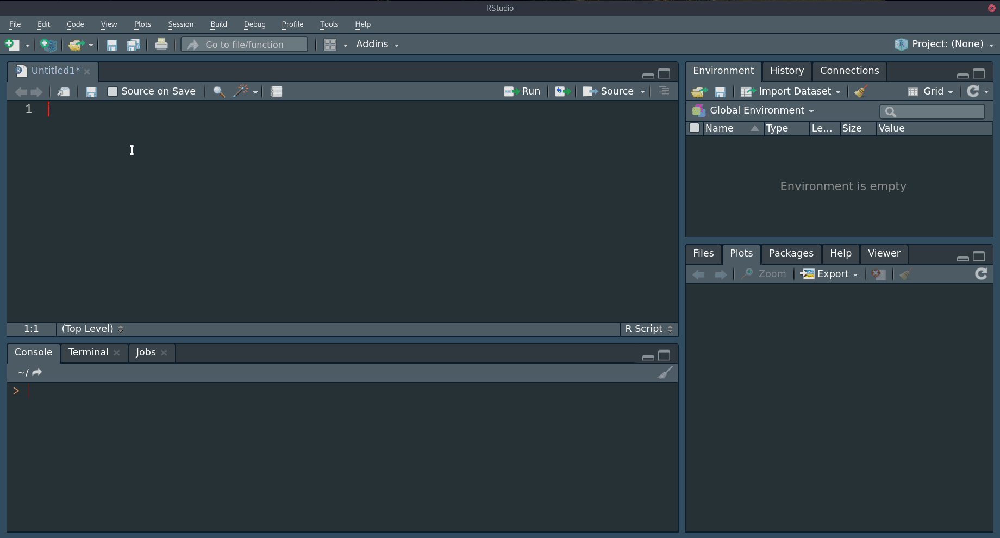
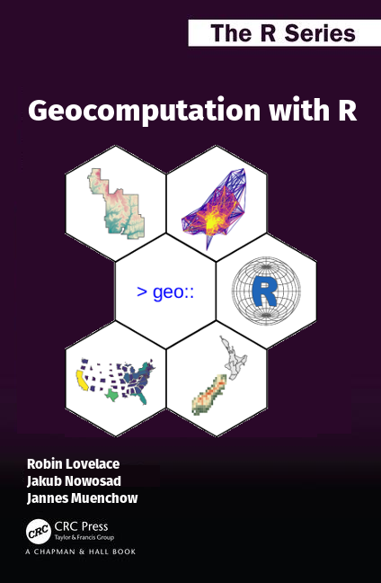

```{r setup, include=FALSE}
options(htmltools.dir.version = FALSE)
knitr::opts_chunk$set(fig.align = "center")
```

# Geocomputation

<!-- grass gis + arc + r -->
.pull-left[

- Automatyzacja często powtarzalnych czynności
- Przejrzystość i powtarzalność
- Inspiracja do tworzenia oprogramowania poprzez dostarczanie narzędzi do modyfikowania istniejących i wdrażania nowych funkcji
- Zachęcenie do dzielenia kodu i wyników oraz współpracy
- Pomoc w rozwijaniu umiejętności programowania, na które istnieje duże zapotrzebowanie

```{r gdsl, echo=FALSE, message=FALSE, results='asis'}
d = readr::read_csv('"Cecha","GIS (GUI)","R (CLI)"
"Dyscyplina","Geografia","Statystyka, Informatyka"
"Sposób interakcji","Graficzny interfejs użytkownika","Wiersz poleceń"
"Odtwarzalność","Minimalna","Maksymalna"')
knitr::kable(x = d, 
             booktabs = TRUE, 
             format = "html")
```

]
<!-- how and why -->
<!-- packages and posibilities -->
<!-- Facilitates the automation of repetitive tasks. -->
<!-- Enables transparency and reproducibility, the backbone of good scientific practice and data science. -->
<!-- Encourages software development by providing tools to modify existing functions and implement new ones. -->
<!-- Helps develop future-proof programming skills which are in high demand in many disciplines and industries. -->
<!-- Is user-friendly and fast, allowing an efficient workflow -->

 <!-- This brings us to the ‘open source approach’, which has three main components: -->

 <!--    A command-line interface (CLI), encouraging scripts recording geographic work to be shared and reproduced. -->
 <!--    Open source software, which can be inspected and potentially improved by anyone in the world. -->
 <!--    An active developer community, which collaborates and self-organizes to build complimentary and modular tools. -->

.pull-right[
```{r, echo=FALSE, out.width="90%"}
knitr::include_graphics(c("figs/qgis.png", "figs/r.png"))
```
]

---
# Geocomputation with R

Ważna zaletą R (czy też np. Pythona) jest bycie językiem interpretowanym.
Jest to szczególnie istotne w analizie danych (nie tylko) przestrzennych, bo pozwala na interaktywne programowanie - kod wpisany w konsoli jest natychmiast wykonywany a wynik jest wyświetlany (nie ma konieczności czekana na kompilację kodu).

Pakiety R:

- **sf**, **raster** - klasy obiektów przestrzennych
- **dplyr**, **rmapshaper** - przetwarzanie tabel atrybutów/geometrii
- **rnaturalearth**, **osmdata**, **getlandsat** - pobieranie danych przestrzennych
- **rgrass7**, **RQGIS**, **RSAGA**, **link2GI** - łączenie z oprogramowaniem GIS
- **gstat**, **mlr**, **CAST** - modelowanie danych przestrzennych
- **rasterVis**, **tmap**, **ggplot** - wizualizacje statyczne
- **leaflet**, **mapview**, **mapdeck** - wizualizacje interaktywne
- wiele innych...

Więcej na https://cran.r-project.org/web/views/Spatial.html.

---
class: inverse, center, middle
# Basics

---
# R

<!-- - R + RStudio -->
<!-- - Simple workflow - gif? -->

```{r, echo=FALSE, out.width="90%"}

```

---
# Dane wektorowe

```{r, echo=FALSE}
library(spData)
```

.pull-left[
```{r, echo=FALSE, out.height=550}
knitr::include_graphics("figs/sf-classes.png", dpi = NA)
```
]


.pull-right[
```{r, message=FALSE}
library(sf)
head(seine)
```

<!-- - Model wektorowy danych oparty jest na punktach położonych wewnątrz danego układu współrzędnych -->

- Pakiet **sf** zapewnia system klas dla danych wektorowych w R
- Dodatkowo ten pakiet wykorzystując biblioteki PROJ, GDAL oraz GEOS pozwala na tranformacje pomiędzy układami przestrzennych, wczytywanie i zapis wielu formatów danych oraz wykonywanie operacji geometryczych
<!-- - Większość funkcji tego pakietu posiada intuicyjne nazwy zaczynające się of prefiksu `st_` -->
]

---
# Vector data

<!-- one more slide -->

---
# Dane rastrowe

.lc[
- Pakiet **raster** zapewnia system klas dla danych rastrowych w R, składający się z prostych obiektów `RasterLayer` oraz wielowartwowych `RasterStack` oraz `RasterBrick`
- Operacje na małych rastrach są wykonywane w pamięci RAM, a przetwarzanie większych rastrów odbywa się poprzez ich podzielenie na kawałki
]

.rc[
```{r, echo=FALSE, out.height=200}
knitr::include_graphics("figs/raster-intro-plot-1.png", dpi = NA)
```

```{r, message=FALSE}
library(raster)
elev
```
]

---
# Raster data

<!-- one more slide -->

---
class: inverse, center, middle
# Analiza transportu

---
# Analiza transportu

.pull-left[
```{r, echo=FALSE, out.height=550}
knitr::include_graphics("figs/desire-1.png", dpi = NA)
```
]

.pull-right[
- Umiejętności tworzenia analiz przestrzennych mogą (powinny?) służyć rozwiązywaniom prawdziwych problemów.
- Książka zawiera trzy praktyczne przykłady - analizę transportu, geomarketingową oraz ekologiczną.
- Analiza transportu: w jaki sposób zwiększyć udział ruchu rowerowego w mieście Bristol?
- Taka analiza obejmuje:

    - Jednostki powierzchniowe
    - Linie celu
    - Trasy
    - Węzły
    - Sieci transportowe

<!-- -    Areal units: transport patterns can be understood with reference to zonal aggregates such as the main mode of travel (by car, bike or foot, for example) and average distance of trips made by people living in a particular zone, covered in section 12.3. -->
<!-- -    Desire lines: straight lines that represent ‘origin-destination’ data that records how many people travel (or could travel) between places (points or zones) in geographic space, the topic of section 12.4. -->
<!-- -    Routes: these are lines representing a path along the route network along the desire lines defined in the previous bullet point. We will see how to create them in section 12.5. -->
<!-- -    Nodes: these are points in the transport system that can represent common origins and destinations and public transport stations such as bus stops and rail stations, the topic of section 12.6. -->
<!-- -    Route networks: these represent the system of roads, paths and other linear features in an area and are covered in section 12.7. They can be represented as geographic features (representing route segments) or structured as an interconnected graph, with the level of traffic on different segments referred to as ‘flow’ by transport modelers (Hollander 2016). -->
]


---
class: inverse, center, middle
# Analiza geomarketingowa

---
# Analiza geomarketingowa

- Przykładem analizy geomarketingowej jest określenie lokalizacji nowego sklepu, która zachęci jak najwięcej klientów i w efekcie da największy zysk.
- Te techniki mogą być też użyte do niekomercyjnych celów, np. lokalizacji placówek służby zdrowia.
- Typowe pytania zadawane w trakcie takiej analizy to, między innymi, jaka jest grupa docelowa i gdzie ona mieszka/często przebywa; gdzie zlokalizowana jest potencjalna konkurencja? 

<!-- - A typical example is where to locate a new shop. The aim here is to attract most visitors and, ultimately, make most profit. There are also many non-commercial applications that can use the technique for public benefit, for example where to locate new health services -->
<!-- - The main task of location analysis is to find out where such ‘optimal locations’ are for specific services, based on available data. Typical research questions include: -->

<!-- -    Where do target groups live and which areas do they frequent? -->
<!-- -    Where are competing stores or services located? -->
<!-- -    How many people can easily reach specific stores? -->
<!-- -    Do existing services over or under-exploit the market potential? -->
<!-- -    What is the market share of a company in a specific area? -->

<!-- This chapter demonstrates how geocomputation can answer such questions based on a hypothetical case study based on real data. -->


<!-- -    Tidy the input data from the German census (section 13.3). -->
<!-- -    Convert the tabulated census data into raster objects (section 13.4). -->
<!-- -    Identify metropolitan areas with high population densities (section 13.5). -->
<!-- -    Download detailed geographic data (from OpenStreetMap, with osmdata) for these areas (section 13.6). -->
<!-- -    Create rasters for scoring the relative desirability of different locations using map algebra (section 13.7). -->

```{r, echo=FALSE, out.height=400}
knitr::include_graphics("figs/08_census_stack.png", dpi = NA)
```

---
# Analiza geomarketingowa

.pull-left[
- Odpowiedź na takie pytania można uzyskać, na przykład, poprzez:
    - Wyczyszczenie dostępnych danych ze spisu powszechnego
    - Przetworzenie danych ze spisu do formy rastrowej
    - Określenie obszarów metropolitalnych z dużym zagęszczeniem populacji
    - Pobranie szczegółowych danych przestrzennych (np. z OpenStreetMap) dla tych obszarów
    - Stworzenie rastrów oceniających względną atrakcyjność różnych lokalizacji
]

.pull-right[

```{r, echo=FALSE, out.height=550}
knitr::include_graphics("figs/08_metro_areas.png", dpi = NA)
```
]
<!-- This chapter demonstrates how geocomputation can answer such questions based on a hypothetical case study based on real data. -->


<!-- -    Tidy the input data from the German census (section 13.3). -->
<!-- -    Convert the tabulated census data into raster objects (section 13.4). -->
<!-- -    Identify metropolitan areas with high population densities (section 13.5). -->
<!-- -    Download detailed geographic data (from OpenStreetMap, with osmdata) for these areas (section 13.6). -->
<!-- -    Create rasters for scoring the relative desirability of different locations using map algebra (section 13.7). -->


---
# Analiza geomarketingowa

Wybrane obszary zgodnie z hipotetycznym scenariuszem tworzenia sklepu rowerowego w Berlinie.

```{r, echo=FALSE, out.height=500}
knitr::include_graphics("figs/08_result.png", dpi = NA)
```

---
class: inverse, center, middle
# Geocomputation with R 

---
# Geocomputation with R - książka

.lc[
```{r, out.width=350, echo=FALSE}

```
]

.rc[
> Lovelace R., Nowosad J., Muenchow J. 2019, **Geocomputation with R**. CRC Press

- Wersja online, dostępna dla wszystkich, znajduje się pod adresem https://geocompr.robinlovelace.net/
<!-- każdy może dodać/zmienić/zaproponować coś-->
- Papierowa wersja książki zostanie opublikowana w wydawnictwie CRC Press na początku 2019 roku (http://bit.ly/geocomp_with_r)
<br>


]

<!-- intro to the book -->
<!-- links-->
<!-- more about open-source! -->

---
# Geocomputation with R


.pull-left[

**Piętnaście rozdziałów** od wprowadzenia do obiektów przestrzennych w R, poprzez podstawowe operacje przestrzenne, wizualizacje, łączenie z oprogramowaniem GIS, uczenie maszynowe, tworzenie funkcji przestrzennych, a skończywszy na przykładach zastosowania.

```{r, echo=FALSE, out.height=375}
knitr::include_graphics("figs/authors-in-czech-republic.jpg", dpi = NA)
```
]

.pull-right[
**Aktywne przeczytanie tej książki zachęca do:**

- Kreatywnego wykorzystania danych przestrzennych
- Zastosowania umiejętności do prawdziwych problemów
- Tworzenia nowych narzędzi
- Dbania o odtwarzalność wyników

**Co dalej?**

- Rozwijanie wiedzy na temat R
- Odkrywanie przetwarzania danych przestrzennych w innych językach programowania
- Eksplorowanie i uczenie się nowych technik i metod
]


---
class: inverse, center, middle
# Podsumowanie

---
# Podsumowanie

---
class: center, middle
<!-- # Dziękuję -->

.pull-left[
## O mnie:

Twitter: `r icon::ii_social_twitter()` jakub_nowosad

Email: nowosad.jakub@gmail.com
]

.pull-right[
## Więcej informacji:

https://nowosad.github.io

https://geocompr.github.io/

]

